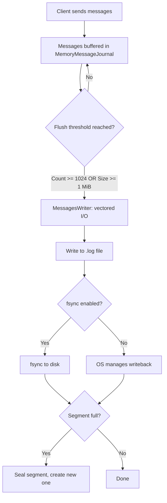

Iggy's storage engine is built around the concept of a **segmented append-only log**. Every piece of data flows through a well-defined hierarchy: System -> Streams -> Topics -> Partitions -> Segments. This page covers how data is stored, indexed, flushed, and managed on disk.

<StreamHierarchy />

<AppendOnlyLogViz />

## Directory layout

All data is stored under the `system.path` directory (default `local_data`):

```bash
local_data/
├── info.json                    # System metadata and version info
├── state.messages               # Write-ahead log for metadata operations
├── backup/                      # Optional backup storage
├── logs/                        # Server log files
├── runtime/                     # Runtime data
└── streams/
    └── {stream_id}/
        └── topics/
            └── {topic_id}/
                └── partitions/
                    └── {partition_id}/
                        ├── 00000000000000000000.log
                        ├── 00000000000000000000.index
                        ├── 00000000000000000100.log
                        └── 00000000000000000100.index
```

Each partition directory contains pairs of `.log` and `.index` files. The filename is the start offset of the first message in that segment, zero-padded to 20 digits.

## Segmented log

<SegmentVisualization />

The `SegmentedLog` is the core storage abstraction per partition. It contains an ordered list of **sealed** (read-only) segments plus one **active** (writable) segment. When the active segment reaches its configured size limit (default 1 GiB), it is sealed and a new active segment is created.

Key segment tracking fields:
- `start_offset` / `end_offset` - first and last message position
- `current_position` - write pointer in bytes
- `size` - configured maximum (must be a multiple of 512 bytes)
- `sealed` - whether the segment accepts new writes

## Message binary format

<MessageHeaderDiagram />

Each message on disk consists of a 64-byte header followed by optional user headers and the payload:

| Field | Bytes | Type | Description |
|-------|-------|------|-------------|
| checksum | 0..8 | u64 | xxHash3 integrity checksum |
| id | 8..24 | u128 | Unique message ID (UUIDv4) |
| offset | 24..32 | u64 | Sequential offset in partition |
| timestamp | 32..40 | u64 | Server-assigned timestamp (microseconds) |
| origin_timestamp | 40..48 | u64 | Client-provided timestamp |
| user_headers_length | 48..52 | u32 | Length of user headers |
| payload_length | 52..56 | u32 | Length of payload |
| reserved | 56..64 | u64 | Reserved, must be 0 |

After the 64-byte header: `user_headers` (variable, length from `user_headers_length`) followed by `payload` (variable, length from `payload_length`).

All fields are stored in **little-endian** byte order. The header is exactly 64 bytes, which allows for efficient aligned reads. Messages are stored contiguously in the `.log` file with no padding between them.

## Indexes

Each segment has an accompanying `.index` file that stores positional and time indexes. These allow the server to quickly locate messages by offset or timestamp without scanning the entire log file.

Index caching can be configured via the `cache_indexes` setting:

| Strategy | Behavior |
|----------|----------|
| `"all"` | All segment indexes loaded at startup, kept in memory |
| `"open_segment"` | Only the active segment's indexes are cached (default) |
| `"none"` | Indexes are loaded on-demand from disk |

If an index file becomes corrupted or goes missing, the `IndexRebuilder` can reconstruct it by scanning the corresponding `.log` file and parsing message headers.

## Write pipeline

Messages flow through a multi-stage pipeline before reaching disk:



The `MessagesWriter` uses **vectored I/O** (`writev`) with `MAX_IOV_COUNT=1024` to batch multiple message buffers into a single syscall, which significantly reduces the overhead of writing many small messages.

The flush thresholds are configurable:
- `messages_required_to_save` (default `1024`, minimum `1`) - count threshold
- `size_of_messages_required_to_save` (default `"1 MiB"`) - size threshold

These are soft limits - the actual count/size may be higher depending on the last batch size.

## Memory pool

Iggy includes a custom memory pool to eliminate allocation overhead on the hot path. The pool has **32 buckets** with buffer sizes ranging from 256 B up to 512 MiB (with non-uniform spacing optimized for common message sizes). When a component needs a buffer, it requests one from the appropriate bucket. When done, the buffer is returned to the pool.

```toml
[system.memory_pool]
enabled = true
size = "4 GiB"           # Total pool size (minimum 512 MiB, page-aligned)
bucket_capacity = 8192    # Buffers per bucket (power of 2, minimum 128)
```

This avoids frequent heap allocations during message processing and enables zero-copy message passing between internal components.

## Zero-copy deserialization

Iggy uses a custom zero-copy deserialization approach for reading messages. Instead of fully deserializing each message from disk, the system maintains a separate index vector of `u32` values pointing to positions within the raw message data buffer. When a consumer polls messages, the server yields **views** into the underlying buffer rather than copying data, and performs just-in-time deserialization only for the fields the consumer actually needs.

This approach delivered significant performance improvements:
- Producer throughput: +40% (1.7 to 2.4 GB/s)
- Consumer throughput: +90% (2.1 to 4.0 GB/s)
- Producer P99 latency: +63% improvement (4.23 to 2.59ms)
- Consumer P99 latency: +50% improvement (2.93 to 1.46ms)

## Retention and cleanup

Iggy supports two independent retention policies for automatic message cleanup, both configurable per topic:

**Size-based retention**: when a topic exceeds `max_size`, the oldest sealed segments are removed to make room. Deletion kicks in at 90% of the limit. The active segment is always protected.

**Time-based retention**: segments with all messages older than `message_expiry` are deleted. The cleaner runs at a configurable interval (default 1 minute) when `cleaner_enabled` is `true`.

Both policies can be active simultaneously and only affect sealed segments. The active segment is never deleted, even if its messages have expired.

## Message deduplication

Optional server-side deduplication can be enabled per partition. When active, a hash-based `MessageDeduplicator` keeps track of recently seen message IDs and silently drops duplicates. This is useful for achieving exactly-once semantics at the application level.

```toml
[system.message_deduplication]
enabled = false
max_entries = 10000       # Max tracked IDs per partition
expiry = "1 m"            # How long to remember seen IDs
```

## Encryption

Iggy supports optional **AES-256-GCM** encryption for message payloads and state commands. When enabled, messages are encrypted before being written to disk and decrypted when read. The encryption key is a 32-byte base64-encoded string.

```toml
[system.encryption]
enabled = false
key = ""  # 32-byte base64-encoded key
```

## Compression

Topic-level compression is supported with the following algorithms: `none`, `gzip`, `lz4`, `zstd`. The `allow_override` setting controls whether individual topics can override the default algorithm.

## Backup and archiving

Sealed segments can be archived to local/NAS storage or S3-compatible cloud storage (AWS S3, MinIO). Since sealed segments are immutable, they are safe to copy in parallel without any coordination. The archive path is configurable under `system.backup.path`.

## State persistence (Write-ahead log)

All metadata operations (create stream, delete topic, create user, etc.) are persisted to a write-ahead log (`state.messages`). Each entry contains:

| Field | Size | Description |
|-------|------|-------------|
| index | 8 bytes | Sequential entry number |
| term | 8 bytes | VSR consensus term |
| timestamp | 8 bytes | Entry timestamp |
| user_id | 4 bytes | Acting user |
| flags | 4 bytes | Entry flags |
| command_length | 4 bytes | Command payload size |
| command_data | variable | Serialized command (MessagePack) |
| checksum | 32 bytes | SHA-256 integrity verification |

State is serialized using **MessagePack** (rmp-serde) for compact binary representation.
